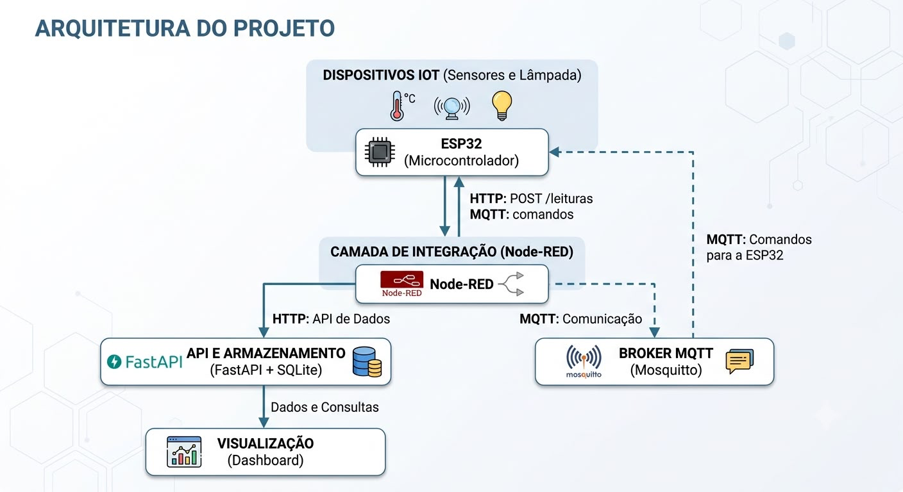
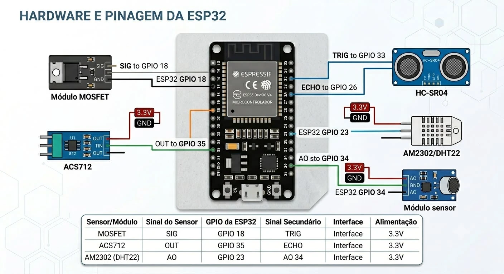

# ReciLuz

> Acesse nosso Drive do projeto: [Google Drive - ReciLuz](https://drive.google.com/drive/folders/1JRUVSHJhsAoAntvT7IyG7CY1mx4hIjT3?usp=sharing)

## Descrição

O **ReciLuz** é um projeto de IoT voltado para iluminação pública inteligente, inspirado no contexto urbano do Recife. O protótipo simula um poste inteligente capaz de controlar a iluminação de forma automática com base em proximidade, medir consumo elétrico, monitorar temperatura, umidade e nível de ruído ambiente, e enviar todos os dados para um painel de monitoramento em tempo real.

## Problema

A iluminação pública tradicional opera em intensidade fixa durante longos períodos, mesmo em horários e locais de baixa circulação, gerando:

- consumo desnecessário de energia;
- dificuldade de monitoramento em tempo real;
- manutenção reativa, dependente de reclamações ou inspeções manuais;
- menor capacidade de planejamento por parte do poder público.

## Solução Implementada

O ReciLuz é um sistema inteligente de iluminação pública baseado em ESP32, com dois modos de operação:

### Modo Presença

Quando o sensor ultrassônico HC-SR04 detecta um objeto ou pessoa a até 40 cm, a lâmpada acende com brilho proporcional à proximidade (quanto mais próximo, mais brilhante). O brilho é controlado via PWM no intervalo de 8 a 255.

### Modo Noite

Quando não há presença detectada, a lâmpada permanece apagada (PWM = 0), economizando energia.

### Controle Remoto (MQTT)

Via dashboard ou diretamente pelo broker MQTT, é possível:

- **Ligar** – acende a lâmpada em brilho máximo, sobrepondo o modo automático.
- **Desligar** – apaga a lâmpada, sobrepondo o modo automático.
- **Automático** – retorna ao controle por sensor de proximidade.

## Arquitetura do Sistema

<div align="center">

  
  <br>
  <strong>Arquitetura de Software</strong>

  <br><br>

  
  <br>
  <strong>Hardware e Pinagem da ESP32</strong>

</div>

O sistema é composto por quatro camadas:

1. **Dispositivos IoT** – ESP32 com sensores, lâmpada LED 12V controlada via MOSFET.
2. **Camada de Integração** – Node-RED recebe leituras do ESP32 via HTTP e se comunica com o broker MQTT.
3. **API e Armazenamento** – FastAPI + SQLite persiste leituras e expõe endpoints para o dashboard e para controle remoto.
4. **Visualização** – Dashboard web servido pelo próprio backend em `/dashboard`.

## Hardware

### Componentes Utilizados

| Componente | Função | GPIO (ESP32) |
|---|---|---|
| MOSFET | Acionamento PWM da lâmpada | GPIO 18 (SIG) |
| ACS712 | Medição de corrente elétrica | GPIO 35 (OUT) |
| HC-SR04 | Detecção de presença/proximidade | GPIO 33 (TRIG), GPIO 26 (ECHO) |
| AM2302 / DHT22 | Temperatura e umidade | GPIO 23 (DATA) |
| Módulo sensor de ruído | Nível de ruído ambiente | GPIO 34 (AO) |
| Lâmpada LED 12V | Iluminação controlada | — |
| Fonte 12V | Alimentação da lâmpada | — |

Todos os sensores são alimentados em 3,3V a partir da própria ESP32.

### Grandezas Medidas

- **Distância** (HC-SR04): 0–400 cm, usado para detecção de presença e cálculo de brilho (faixa efetiva: 5–40 cm).
- **Corrente** (ACS712): calculada com calibração automática do offset no boot; potência estimada usando 12V como tensão de referência.
- **Temperatura e umidade** (AM2302/DHT22): lidas a cada 2,5 s.
- **Nível de ruído** (sensor analógico): estimado em dB por escala logarítmica (35–90 dB); detecção ativa acima de 55 dB.

## Stack Tecnológico

| Camada | Tecnologia |
|---|---|
| Firmware | Arduino Framework, PlatformIO |
| Comunicação MQTT | PubSubClient |
| Sensor DHT | Adafruit DHT sensor library |
| Integração | Node-RED |
| MQTT Broker | Eclipse Mosquitto |
| Backend | FastAPI, SQLAlchemy, SQLite, Pydantic, Uvicorn |
| Infraestrutura | Docker, Docker Compose |
| Frontend | HTML, CSS, JavaScript (Vanilla) |

## Estrutura do Projeto

```
Projeto-SE-Grupo-8/
├── Project-ReciLuz/
│   ├── backend/           # FastAPI + SQLite
│   │   ├── app/
│   │   │   ├── models.py
│   │   │   ├── schemas.py
│   │   │   ├── routes/    # lampada, leituras, relatorio
│   │   │   └── services/  # lampada, leituras, nodered, relatorio
│   │   ├── main.py
│   │   └── requirements.txt
│   ├── firmware/          # Código ESP32 (PlatformIO)
│   │   └── src/main.cpp
│   ├── frontend/          # Dashboard web
│   │   ├── index.html
│   │   ├── app.js
│   │   └── styles.css
│   └── infra/             # Docker Compose, Node-RED flows, Mosquitto
│       ├── docker-compose.yml
│       ├── flows.json
│       └── mosquitto.conf
├── docs/assets/           # Imagens do README
└── medicao_eficiencia.py  # Script de cálculo de eficiência energética
```

## API

| Método | Endpoint | Descrição |
|---|---|---|
| `GET` | `/lampada/status` | Status atual da lâmpada |
| `POST` | `/lampada/ligar` | Liga remotamente |
| `POST` | `/lampada/desligar` | Desliga remotamente |
| `POST` | `/lampada/automatico` | Retorna ao modo automático por sensor |
| `POST` | `/leituras` | Recebe leitura do Node-RED |
| `GET` | `/leituras` | Lista leituras (padrão: últimas 100) |
| `GET` | `/leituras/ultimas` | Última leitura |
| `POST` | `/relatorio/assinar` | Inscreve e-mail no relatório diário |
| `POST` | `/relatorio/cancelar` | Cancela inscrição |
| `POST` | `/relatorio/enviar-agora` | Dispara relatório imediatamente |
| `GET` | `/dashboard` | Serve o dashboard web |

## Como Executar

### Pré-requisitos

- Docker e Docker Compose instalados
- PlatformIO (para compilar e gravar o firmware na ESP32)

### Infraestrutura (backend + Node-RED + MQTT)

```bash
cd Project-ReciLuz/infra
docker compose up -d
```

Serviços disponíveis após a inicialização:

| Serviço | URL |
|---|---|
| Dashboard | http://localhost:8000/dashboard |
| API (docs) | http://localhost:8000/docs |
| Node-RED | http://localhost:1880 |
| MQTT Broker | localhost:1883 |

### Variáveis de Ambiente

Copie o arquivo de exemplo e preencha com suas credenciais:

```bash
cp Project-ReciLuz/backend/.env.example Project-ReciLuz/backend/.env
```

| Variável | Descrição |
|---|---|
| `DATABASE_URL` | Caminho do banco SQLite (padrão: `sqlite:///./reciluz.db`) |
| `NODE_RED_COMMAND_URL` | URL do endpoint de comandos no Node-RED |
| `SMTP_HOST` | Servidor SMTP para envio de relatórios (deixe vazio para desativar) |
| `SMTP_PORT` | Porta SMTP (padrão: 587) |
| `SMTP_USER` | Usuário/e-mail SMTP |
| `SMTP_PASSWORD` | Senha de app do Gmail |
| `SMTP_FROM` | Remetente exibido no e-mail |
| `RELATORIO_HORA_ENVIO` | Hora do envio diário do relatório (0–23, fuso horário de Recife) |

### Firmware (ESP32)

Abra o projeto `Project-ReciLuz/firmware` no PlatformIO, ajuste as constantes de rede no início de `src/main.cpp`:

```cpp
const char* WIFI_SSID     = "sua-rede";
const char* WIFI_PASSWORD = "sua-senha";
const char* BACKEND_URL   = "http://<IP_DO_HOST>:1880/leituras";
const char* MQTT_BROKER   = "<IP_DO_HOST>";
```

Em seguida, compile e grave na ESP32:

```bash
pio run --target upload
```

## Relatório Diário por E-mail

O sistema envia automaticamente um relatório diário com as métricas de consumo e operação para todos os assinantes cadastrados. O horário de envio é configurável pela variável `RELATORIO_HORA_ENVIO` (fuso horário de Recife). Para se inscrever:

```bash
curl -X POST http://localhost:8000/relatorio/assinar \
  -H "Content-Type: application/json" \
  -d '{"email": "seu@email.com"}'
```

## Indicadores de Eficiência

| Indicador | Como é calculado |
|---|---|
| Corrente (A) | Leitura do ACS712 com calibração de offset |
| Potência (W) | `corrente × 12V` |
| Consumo estimado (kWh) | `(potência / 1000) × (intervalo_ms / 3.600.000)` por leitura |
| Economia estimada | Comparação entre consumo contínuo em brilho máximo e consumo real medido |
| Presença detectada | Distância ≤ 40 cm medida pelo HC-SR04 |
| Nível de ruído (dB) | Escala logarítmica baseada no pico a pico do sensor analógico |
